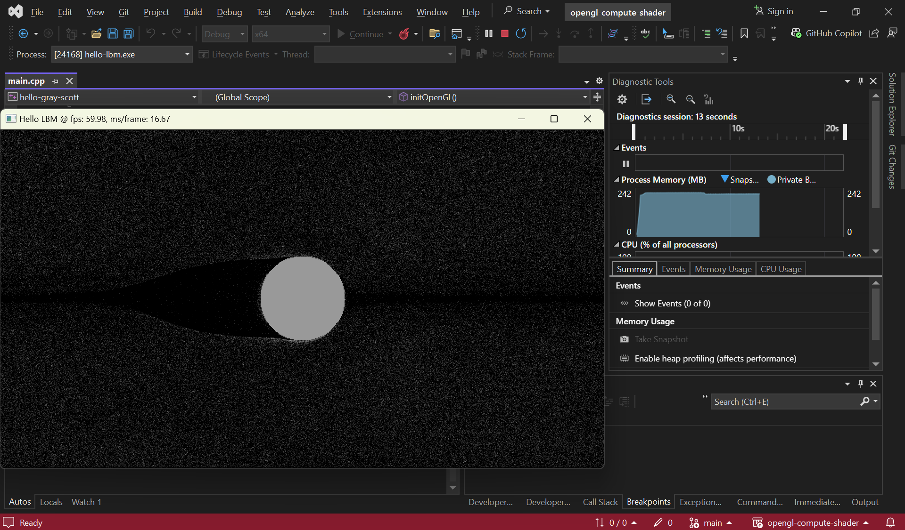

# OpenGL Compute Shader

> https://maciejmatyka.blogspot.com/2022/01/compute-shaders-in-open-frameworks.html


## Demo 1:  Gray Scott Reaction-Diffusion System


## Demo 2: LBM Fluid


## Windows Users

Open `opengl-compute-shader.sln` and compile.




## Linux Users

### Install vcpkg

```
$ sudo apt install build-essential pkg-config cmake curl zip unzip tar ninja-build
$ sudo apt install libxinerama-dev libxcursor-dev xorg-dev libglu1-mesa-dev
$ sudo apt install libxrandr-dev libxi-dev

$ git clone https://github.com/microsoft/vcpkg.git
$ cd vcpkg
$ ./bootstrap-vcpkg.sh
$ echo 'export VCPKG_ROOT=$HOME/vcpkg' >> ~/.bashrc
$ echo 'export PATH=$PATH:$VCPKG_ROOT' >> ~/.bashrc
$ source ~/.bashrc
$ vcpkg integrate install
```

### Compile

```
$ cd hello-gray-scott
$ cmake -B build --preset vcpkg
$ cmake --build build
$ ./build/hello-gray-scott
```

```
$ cd hello-lbm
$ cmake -B build --preset vcpkg
$ cmake --build build
$ ./build/hello-lbm
```
